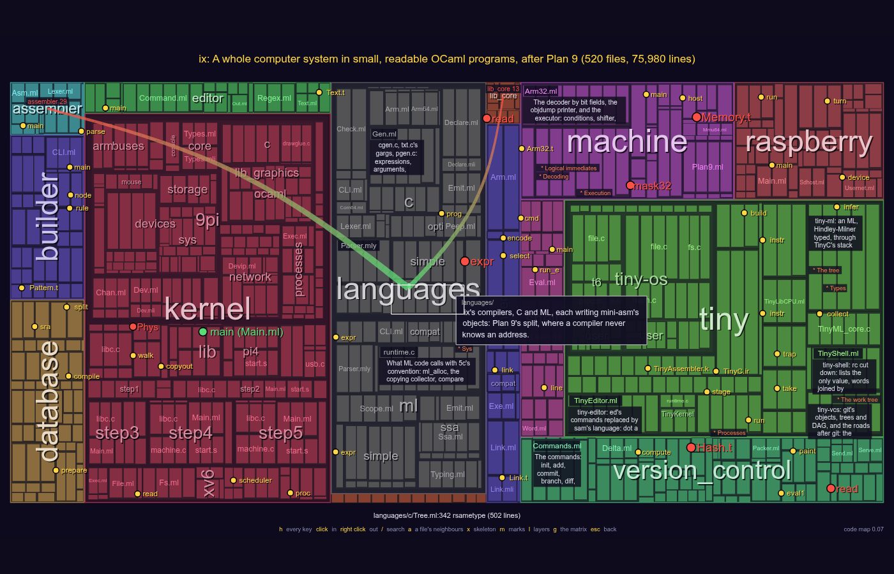
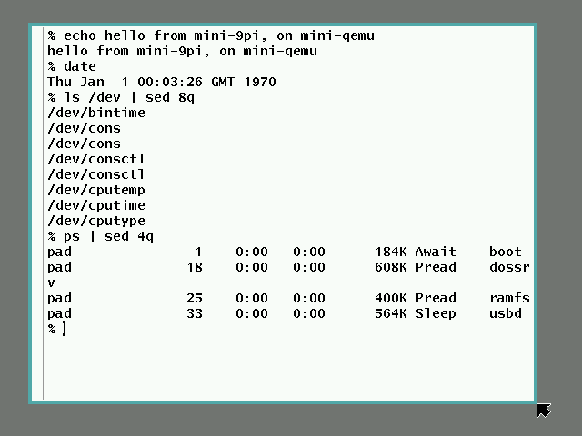
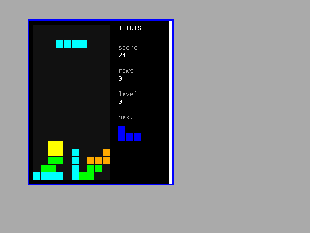

# 

**A whole computer system in small, readable OCaml programs: an ARM
emulator, a kernel, a shell, C and ML compilers, an assembler and a linker,
an editor, a build system, a database, version control, and more.**

Website: **[aryx.github.io/IX](https://aryx.github.io/IX/)**, with a
[code map](https://aryx.github.io/IX/codemap.html) of the whole
repository to explore in the browser ([below](#the-code-map)).

IX is a way to learn how a computer system works, end to end, by
reading its code. Each part of the system is a separate program, and
each program is small enough to read in a few sittings. None of them
is a toy, though. The emulator runs real ARM binaries, the compiler
makes them, and the kernel boots a real operating system's user
programs, up to its windowing system and the network.

The system IX follows is **Plan 9**, the successor of Unix written at
Bell Labs by Unix's own authors. Plan 9 is small, clean, and complete:
it has its own kernel, compilers, shell (`rc`), build tool (`mk`),
editor and windowing system (`rio`). It is explained program by
program in [Principia Softwarica](https://principia-softwarica.org/), a
series of books I (Yoann Padioleau) wrote, and my
[xix](https://aryx.github.io/xix/) project ports those programs to
OCaml at full size. You don't need to know either to read IX. IX
takes the same programs and makes each of them as small as it can.

## The goal: code a person can understand

Teaching people is the main goal of IX, and the test it sets itself is
that one person can understand all of it, not only each program.

Most software fails that test. A kernel, a compiler or a browser of
today is millions of lines and grows every year, until no single
person understands it, its own authors included. Plan 9 is one of the
few exceptions, which is why IX follows it.

Most of IX's code is written by an AI (see
[Who wrote it](#who-wrote-it)), but it does not start from nothing.
It starts from designs made by people (Plan 9's, xv6's, xix's), and it
is directed to write the smallest and most readable code that does the
job. That code is then meant to become
[literate programs](https://principia-softwarica.org/literate-programming.html), as in
Principia Softwarica: books of a reasonable size that explain all of
the code to a human reader.

That is the paradox of IX. The trend these days is to use AI to write
more and more code, faster than anyone can read it, until only the AI
can add a feature to the program. This was already partly true before
AI: many programs had grown so big that they were very hard to change.
IX uses AI the other way. Here it rewrites giant programs in far
**less** code, until a whole system is small enough for a person to
understand again, and to extend: by hand, or by asking the AI, but in
a way that person can still follow. AI can help people take back
control of the programs they use.

**AI makes the programs smaller. Humans understand more.**

## Two sizes of each program: m-IX and t-IX

Each program in IX comes in two versions:

- **mini** (`mini-mk`, `mini-rc`, `mini-cc`, ...): a faithful
  reimplementation of the Plan 9 program, only smaller. It is named
  after the original and does the same thing: its output is the
  original's, byte for byte. The executables `mini-cc` and `mini-ld`
  make are the ones Plan 9's compiler and linker make. Together, the
  mini programs are **m-IX** (a nod to Knuth's MIX computer).
- **tiny** (`tiny-build`, `tiny-shell`, `tiny-c`, ...): a free
  variant, in a single file under [`tiny/`](tiny/). It is named after
  what it does, not after the original. It keeps the idea of the
  original and redesigns the rest, now that compatibility no longer
  matters. Together, the tiny programs are **t-IX**.

For example, `mini-mk` reads real Plan 9 mkfiles and builds all of
xix from them, and all of Principia Softwarica's Plan 9, kernel
included. `tiny-build` is a build system in one file of about
450 lines. It keeps mk's rules and `%` patterns, and uses content
digests instead of timestamps. Reading the two side by side shows
what is essential to a build system and what is history.

## The code map

[IX's code map](https://aryx.github.io/IX/codemap.html) shows the
whole repository as a map, in the browser: each folder a region, each
file a block the size of its code, each block the code itself once you
zoom in. Every folder and file carries a one-line summary, and the
X-ray (`x`) shows each part's skeleton, the few definitions the rest
hangs on and how they connect. `/` searches, a click on a name shows
its definition, `g` shows the dependencies between the parts as a
matrix, and `h` lists every key.

[](https://aryx.github.io/IX/codemap.html)

A link can open it on any part of the code:
[a folder](https://aryx.github.io/IX/codemap.html?focus=version_control),
[a file](https://aryx.github.io/IX/codemap.html?focus=tiny/TinyShell.ml),
[a definition](https://aryx.github.io/IX/codemap.html?focus=version_control&def=diff);
the tables below link each program so. It is tinybox's code map, from
[ocaml-elm-playground](https://github.com/aryx/ocaml-elm-playground),
after the author's [codemap](https://github.com/aryx/codemap); what it
says of each part comes from the `.codemapconfig` files in each
directory.

## m-IX: the mini programs

The line counts are OCaml, comments and `.mli` files included, tests
excluded. Each program's *map* link opens it in the code map.

| program | what it is | lines | Plan 9 original | code |
|---|---|---:|---|---|
| **mini-5i** | an ARM emulator for user programs, arm32 and arm64, with Linux's or Plan 9's system calls | 4,300 | `5i` | [`machine/`](machine/) ([map](https://aryx.github.io/IX/codemap.html?focus=machine)) |
| **mini-qemu** | a Raspberry Pi 1 and Pi 4 (MMU, interrupts, timer, UART, SD card, framebuffer, USB keyboard, mouse and network), which boots xv6, Plan 9 and IX's own kernels, as QEMU does | 3,500 | QEMU's raspi machines | [`raspberry/`](raspberry/) ([map](https://aryx.github.io/IX/codemap.html?focus=raspberry)) |
| **mini-9pi** | Plan 9's kernel in OCaml, on the Pi 1 and the Pi 4: boots Plan 9's own user programs up to the shell, the `rio` windowing system and TCP | 9,000 | `9pi` | [`kernels/9pi/`](kernels/9pi/) ([map](https://aryx.github.io/IX/codemap.html?focus=kernels/9pi)) |
| **mini-xv6** | MIT's teaching kernel xv6 in OCaml, on the Pi 1 and the Pi 4 | 1,600 | xv6 | [`kernels/xv6/`](kernels/xv6/) ([map](https://aryx.github.io/IX/codemap.html?focus=kernels/xv6)) |
| **mini-cc** | the C compiler for arm and arm64; the same instructions as Plan 9's `5c` and `7c` | 4,600 | `5c`, `7c` | [`languages/c/`](languages/c/) ([map](https://aryx.github.io/IX/codemap.html?focus=languages/c)) |
| **mini-ml** | a native compiler for OCaml (the subset IX is written in), for arm and arm64; it compiles all of IX, the kernels included | 4,300 | ocaml-light's `ocamlopt` | [`languages/ml/`](languages/ml/) ([map](https://aryx.github.io/IX/codemap.html?focus=languages/ml)) |
| **mini-asm** | the assembler for arm and arm64 | 800 | `5a`, `7a` | [`assembler/`](assembler/) ([map](https://aryx.github.io/IX/codemap.html?focus=assembler)) |
| **mini-ld** | the linker, to Plan 9's a.out, Linux's ELF and macOS's Mach-O (arm64); the same executables as the original's, byte for byte | 2,600 | `5l`, `7l` | [`linker/`](linker/) ([map](https://aryx.github.io/IX/codemap.html?focus=linker)) |
| **mini-rc** | the shell | 2,100 | `rc` | [`shell/`](shell/) ([map](https://aryx.github.io/IX/codemap.html?focus=shell)) |
| **mini-ed** | the line editor | 1,200 | `ed` | [`editors/ed/`](editors/ed/) ([map](https://aryx.github.io/IX/codemap.html?focus=editors/ed)) |
| **mini-mk** | the build system; builds all of xix and of Principia Softwarica's Plan 9 from their mkfiles | 2,400 | `mk` | [`builder/`](builder/) ([map](https://aryx.github.io/IX/codemap.html?focus=builder)) |
| **mini-chidb** | a relational database: SQL, a query optimizer, B-trees | 2,900 | [chidb](https://github.com/uchicago-cs/chidb), SQLite's teaching twin | [`database/`](database/) ([map](https://aryx.github.io/IX/codemap.html?focus=database)) |
| **mini-git**, **mini-diff**, **mini-merge3** | version control, compatible with git repositories | 4,700 | `git9`, `diff` | [`version_control/`](version_control/) ([map](https://aryx.github.io/IX/codemap.html?focus=version_control)) |

That is about 50,000 lines of OCaml, with mini-lex and mini-yacc
(1,300) and what the two kernels share; the command-line utilities
(7,500) and mini-rio (1,400) make it 59,100. Under them: 4,700 lines of C and
assembly (mini-ml's runtime, the kernels' start), and the libraries,
[`lib_core/`](lib_core/) ([map](https://aryx.github.io/IX/codemap.html?focus=lib_core)) (what the programs share, mini-ml's
standard library and the C library under it: 20,300),
[`lib_crypto/`](lib_crypto/) ([map](https://aryx.github.io/IX/codemap.html?focus=lib_crypto)) (SHA-1) and
[`lib_compression/`](lib_compression/) ([map](https://aryx.github.io/IX/codemap.html?focus=lib_compression)) (zlib).
m-IX is **about 85,000 lines** in all, of a budget of 100,000
(`make loc`; its log is [docs/loc.md](docs/loc.md); the budget is
[below](#the-budget)).

## t-IX: the tiny programs

Each one is a single file in [`tiny/`](tiny/) ([map](https://aryx.github.io/IX/codemap.html?focus=tiny)).
[tiny/README.md](tiny/README.md) says what idea each one keeps from
its original and what it redesigns.

| program | what it is | lines | mini twin | file |
|---|---|---:|---|---|
| **tiny-arm** | an arm64 CPU for user programs: it runs what tiny-assembler, tiny-c and tiny-ml make, as Linux would | 460 | mini-5i | [`TinyCPUArm.ml`](tiny/TinyCPUArm.ml), [`TinyLibArm.ml`](tiny/TinyLibArm.ml) ([map](https://aryx.github.io/IX/codemap.html?focus=tiny/TinyCPUArm.ml)) |
| **tiny-pi** | tiny-arm's CPU in a Pi 4: exception levels, exceptions, timer, interrupt controller, UART; its page of kernel also runs under QEMU | 370 | mini-qemu | [`TinyMachinePi.ml`](tiny/TinyMachinePi.ml) ([map](https://aryx.github.io/IX/codemap.html?focus=tiny/TinyMachinePi.ml)) |
| **tiny-cpu** | a CPU of our own design, for teaching, with its assembler | 560 | mini-5i, Knuth's MIX | [`TinyCPU.ml`](tiny/TinyCPU.ml), [`TinyLibCPU.ml`](tiny/TinyLibCPU.ml) ([map](https://aryx.github.io/IX/codemap.html?focus=tiny/TinyCPU.ml)) |
| **tiny-machine** | tiny-cpu with what a kernel needs: two modes, traps, a timer, protection, a console, a disk, a screen and a mouse | 600 | mini-qemu | [`TinyMachine.ml`](tiny/TinyMachine.ml) ([map](https://aryx.github.io/IX/codemap.html?focus=tiny/TinyMachine.ml)) |
| **tiny-kernel** | a kernel in ML for tiny-machine: fork and exec, preemption, pipes, files, a screen that programs draw on by messages | 760 | mini-9pi | [`TinyKernel.ml`](tiny/TinyKernel.ml) ([map](https://aryx.github.io/IX/codemap.html?focus=tiny/TinyKernel.ml)) |
| **tiny-graphics** | the kernel's drawing: one operation, `draw`, on images a byte a pixel; texts, lines; a program says what by messages | 270 | mini-9pi's draw device | [`TinyGraphics.ml`](tiny/TinyGraphics.ml) ([map](https://aryx.github.io/IX/codemap.html?focus=tiny/TinyGraphics.ml)) |
| **tiny-windows** | a window system, a program in ML: a window looks like the machine, so it runs in one of its own windows | 500 | mini-rio | [`TinyWindows.ml`](tiny/TinyWindows.ml), [`TinyDraw.ml`](tiny/TinyDraw.ml) ([map](https://aryx.github.io/IX/codemap.html?focus=tiny/TinyWindows.ml)) |
| **tiny-playground** | what a game is written on: a model, a view as shapes, a key, a frame; the loop and the drawing are the library's | 160 | the playground | [`TinyPlayground.ml`](tiny/TinyPlayground.ml) ([map](https://aryx.github.io/IX/codemap.html?focus=tiny/TinyPlayground.ml)) |
| **tiny-tetris** | Tetris, in a window of tiny-windows | 200 | the playground's Tetris | [`TinyTetris.ml`](tiny/TinyTetris.ml) ([map](https://aryx.github.io/IX/codemap.html?focus=tiny/TinyTetris.ml)) |
| **tiny-c** | a C subset compiler, to arm64 and to tiny-cpu | 1,200 | mini-cc | [`TinyC.ml`](tiny/TinyC.ml) ([map](https://aryx.github.io/IX/codemap.html?focus=tiny/TinyC.ml)) |
| **tiny-ml** | an ML compiler (Hindley-Milner types, closures, exceptions, a garbage collector) to arm64 and to tiny-cpu | 1,770 | mini-ml | [`TinyML.ml`](tiny/TinyML.ml) ([map](https://aryx.github.io/IX/codemap.html?focus=tiny/TinyML.ml)) |
| **tiny-assembler** | assembler and linker in one, to arm64 executables (or a kernel's raw image) | 710 | mini-asm, mini-ld | [`TinyAssembler.ml`](tiny/TinyAssembler.ml) ([map](https://aryx.github.io/IX/codemap.html?focus=tiny/TinyAssembler.ml)) |
| **tiny-shell** | a shell in rc's spirit: lists as the only value | 680 | mini-rc | [`TinyShell.ml`](tiny/TinyShell.ml) ([map](https://aryx.github.io/IX/codemap.html?focus=tiny/TinyShell.ml)) |
| **tiny-editor** | an editor with sam's command language | 800 | mini-ed | [`TinyEditor.ml`](tiny/TinyEditor.ml) ([map](https://aryx.github.io/IX/codemap.html?focus=tiny/TinyEditor.ml)) |
| **tiny-build** | a build system: rules, `%`, digests, `-j` | 440 | mini-mk | [`TinyBuildSystem.ml`](tiny/TinyBuildSystem.ml) ([map](https://aryx.github.io/IX/codemap.html?focus=tiny/TinyBuildSystem.ml)) |
| **tiny-db** | a database whose query language is the relational algebra, over a copy-on-write B-tree | 620 | mini-chidb | [`TinyDatabase.ml`](tiny/TinyDatabase.ml) ([map](https://aryx.github.io/IX/codemap.html?focus=tiny/TinyDatabase.ml)) |
| **tiny-vcs** | version control with git's objects, an undo log, and no staging area | 690 | mini-git | [`TinyVCS.ml`](tiny/TinyVCS.ml) ([map](https://aryx.github.io/IX/codemap.html?focus=tiny/TinyVCS.ml)) |

That is about 11,000 lines of OCaml and ML; with the operating system below,
t-IX is **about 18,000 lines** in all, of a budget of 20,000. The last
four rows are not programs of the host: they run on tiny-machine, in
or on tiny-kernel, compiled by tiny-ml (and by OCaml too, for their
tests). tiny-cpu and tiny-machine also
run [`tiny/tiny-os/`](tiny/tiny-os/) ([map](https://aryx.github.io/IX/codemap.html?focus=tiny/tiny-os)), an operating system written for
them in their assembly and in C for `tiny-c`: a page-long kernel (v0),
an xv6-like kernel with a disk and a shell (v6), and a free variant of
it (t6).

## Build and run

```bash
make          # builds everything; the executables are then in bin/
make test
./bin/mini-mk -h            # every program has -h, with examples
./mini-pi mini-9pi          # boot mini-9pi on mini-qemu, with ix's own programs (mini-rc...)
./mini-pi mini-9pi-principia -g   # with principia's programs and SD card: type rio
./tiny-machine v6           # boot tiny-os's xv6-like kernel on tiny-machine
./tiny-machine -window tiny-kernel   # tiny-kernel and its screen: type tiny-windows, then tetris in a window
```

mini-9pi under mini-qemu, running Plan 9's own `rio`
(`kernels/9pi/tests/screenshot.py` made the picture):



tiny-kernel on tiny-machine, Tetris in a window of tiny-windows (the
screen at the end of a recorded session, `tiny/TinyKernel/tetris.events`):



The tests, short and whole:

```bash
make test-lite      # under a minute, on all the cores: unit tests, mini-ml on IX,
                    # IX built by IX from nothing, a kernel booted
make test-all       # every test suite, one after the other, with a summary: half an
                    # hour (tests/all.sh -l lists them; -quick: the short ones)
```

`dune install` installs both the mini and the tiny executables.
`make build-docker` builds and tests IX in a fresh Ubuntu (the
[`Dockerfile`](Dockerfile), which GitHub Actions runs with OCaml 4.14.2
and 5.5.1).

The plans, tutorials, manuals and related-work notes are indexed in
[docs/README.md](docs/README.md), and
[docs/projects.md](docs/projects.md) maps the projects inside IX: the
machines (real ARM, or our own) and what runs on each.

## Bootstrapping

IX builds itself. The first build needs a compiler from outside:
`make` uses dune, OCaml 4.14 and, under OCaml, gcc. After it, IX's own
tools are enough: mini-mk runs the mkfiles, mini-ml, mini-lex and
mini-yacc compile the OCaml, mini-cc and mini-asm the C library and
mini-ml's runtime, mini-ar and mini-ld link. No OCaml compiler, gcc,
GNU binutils or glibc is run or linked; the results are under `_mk/`.

```bash
make                # stage 0: IX built by OCaml and dune (bin/)
make ix             # stage 1: IX built by stage 0's tools, for arm64 (make ix-arm: for arm)
make test-fixpoint  # stage 2: IX built by stage 1's tools: the same files
make kernels-ix     # mini-xv6 and mini-9pi for the Pi 4, the same way
make test-ix        # each program of stage 1 against dune's build of it
```

Stage 2 is the fixed point: IX built by the programs that IX built
gives the same 383 files as stage 1, byte for byte, in about a minute
on a large machine. On arm, where the programs run under qemu-arm, the
second and third builds are the same 358 files (`make
test-fixpoint-arm`). The kernels built this way boot on the Pi 4 under
mini-qemu and QEMU and pass the same checks as the ones built by
ocaml-light and gcc (`make test-kernels-ix`).

What is not built by IX: mini-qemu, which opens its window with SDL,
and the tests. The plan and its history are in
[docs/plans/done/plan_mkfiles.md](docs/plans/done/plan_mkfiles.md) and
[docs/plans/plan_ml_bootstrap.md](docs/plans/plan_ml_bootstrap.md).

## Tiny (and mini), not Toy

There is a good tradition of teaching computer systems by their code:
[Nand2Tetris](https://www.nand2tetris.org/)
([*The Elements of Computing Systems*](https://www.nand2tetris.org/book))
for the whole stack, [Minix](https://www.minix3.org/)
([*Operating Systems: Design and Implementation*](https://en.wikipedia.org/wiki/Operating_Systems:_Design_and_Implementation))
for an operating system, and [xv6](https://pdos.csail.mit.edu/6.828/xv6)
for a kernel. The Nand2Tetris route makes everything minimal: a made-up machine, a
made-up assembler, a made-up OS. IX aims for the full stack too, but
makes the *programs* tiny, not the things they deal with:

- **The machine is real ARM**, arm32 and arm64. mini-5i runs user
  programs; mini-qemu is a whole Raspberry Pi, so that real kernels,
  not just user programs, run on it. The emulator stops with
  "unimplemented instruction" on what it does not know, so it also
  checks that a binary stays inside what IX handles.
- **The binaries are real.** mini-cc, mini-asm and mini-ld make them as
  Plan 9's compilers do, in three formats: ELF for Linux (arm and
  arm64), Mach-O for macOS (arm64, to sign with `codesign`), and
  Plan 9's a.out. So you can use the toolchain for programs on your
  own machine, as with [goken](https://github.com/aryx/goken9cc). The
  same binary runs on IX's emulator, on
  QEMU and on a real ARM machine. Running it on several and comparing
  the results is the main test.
- **The system calls are real.** User programs talk to the kernel
  with Plan 9's system call ABI, and mini-9pi runs Plan 9's own user
  programs, unmodified, from Plan 9's own SD card image.

One group of tiny programs takes the other road on purpose. tiny-cpu
and tiny-machine are a made-up machine, as Knuth's MIX and
[MMIX](https://www-cs-faculty.stanford.edu/~knuth/mmix.html)
([*MMIXware: A RISC Computer for the Third Millennium*](https://www-cs-faculty.stanford.edu/~knuth/mmixware.html))
and Nand2Tetris's Hack are, because what they teach is the design of an
instruction set: the choices a real one made for history's reasons,
made again with hindsight. They stand next to tiny-arm and tiny-pi,
the same two programs for real ARM, so that the two roads can be
compared.

## Still to come

The rest of the system, following the Principia Softwarica books (the
names are not final):

| part | mini | tiny | Plan 9 original |
|---|---|---|---|
| Debuggers | mini-db, mini-acid | tiny-debugger | `db`, `acid` |
| Profilers | mini-prof | tiny-profiler | `prof`, `tprof` |
| Graphics stack | mini-draw | tiny-draw | `libdraw`, `libmemdraw`, `devdraw` |
| Windowing system | mini-rio | tiny-windows | `rio` |
| GUI toolkit | mini-panel | tiny-gui | `libpanel` |
| Network stack | mini-ip | tiny-net | `devip`, `libip`, `lib9p` |
| Web browser | mini-mothra | tiny-browser | `mothra`, `webfs` |
| Command-line utilities | mini-cat, mini-ls, mini-grep, mini-hoc, mini-awk, mini-dc, mini-bc, ... | | `cat`, `ls`, `grep`, `sed`, `awk`, `hoc`, `dc`, `bc` |
| Games | the author's playground's, on its library (`games/`, `lib_playground/`): Tetris | | `games/4s` |

mini-9pi already has parts of some of these in its kernel (the draw
device, the IP stack), with Plan 9's C programs running on top.

### The budget

A system a person can read needs a limit set before it is full:
**100,000 lines for m-IX** and **20,000 for t-IX**, tests excluded.
What is still to come has to fit in what is left, and when it does
not, something is trimmed first.

| | budget | today (2026-10-08) | left | what is missing |
|---|---:|---:|---:|---|
| **m-IX** | 100,000 | 85,300 | 14,700 | the debuggers, the profiler, the GUI toolkit, the web browser; the graphics and the network stacks outside the kernel; the rest of the utilities (7,500 lines of them are in, and mini-rio, 900) |
| **t-IX** | 20,000 | 17,900 (2026-10-09) | 2,100 | tiny-debugger, tiny-profiler, tiny-gui, tiny-net, tiny-browser (tiny-graphics, tiny-windows, tiny-playground and a Tetris in a window are in: 1,800 lines where 1,100 were planned, [plan_tiny_windows.md](docs/plans/done/plan_tiny_windows.md)) |

[docs/loc.md](docs/loc.md) is the log of these numbers, with what
moved them.

## Design

- **Everything is OCaml, the kernel included, and it runs as a real
  binary.** Unlike Nachos, where the "OS" is ordinary code running on
  the host, mini-9pi is an actual ARM binary: a thin layer of C and
  assembly boots the machine and starts a stripped-down OCaml runtime,
  and the kernel is OCaml from there on. The same binary boots on
  mini-qemu and on QEMU, and is meant for a real Raspberry Pi too.
  Processes, address
  spaces, context switches, supervisor and user mode and the system
  call boundary are therefore real. Today mini-9pi is compiled by
  ocaml-light's `ocamlopt`; mini-ml is being written to take over.

  ```
   user program (a.out)                          user mode
   ----------------- SWI / trap / irq -----------------------
   mini-9pi (OCaml + thin C/asm runtime shim)     supervisor mode
   ---------------------------------------------------------------
   ARM CPU + CP15 (MMU, modes): a real Raspberry Pi, or
   mini-qemu emulating one, with disk, timer, framebuffer,
   keyboard, mouse and network
  ```

- **Most tools are terminal programs.** They read and write files,
  stdin and stdout, and depend on nothing graphical. They follow
  [xix](https://aryx.github.io/xix/)'s capability style (`Cap.*`) for
  OS access.
- **Only mini-qemu depends on a GUI library** (SDL), to show the
  machine's framebuffer and feed it the keyboard and mouse. The
  machine itself is a pure library, so it also runs in a terminal. The
  graphical programs (rio and those it runs) run *inside* the machine
  and draw into its framebuffer, as on a real computer.

## Who wrote it

IX is mostly written by Claude (Anthropic's AI, in Claude Code), under
my direction: I choose the design and review the code, and Claude
writes most of the lines, for people to read
([the goal](#the-goal-code-a-person-can-understand)). xix, on the other hand, I mostly wrote
myself. Putting each mini program next to its xix twin makes a fair
comparison of the two ways of working. The project started on
2026-09-21; [docs/history.md](docs/history.md) tells how.

[docs/yoann_notes/prompt-history.md](docs/yoann_notes/prompt-history.md)
shows the other side of that work: every prompt I wrote to Claude to
build IX, in order and verbatim (typos included), each followed by a
short summary of Claude's answer. Hooks in `.claude/` append the
entries as I work, so the file grows with the repository. Read next to
`git log`, it shows what directing an AI to write a codebase looks like
day to day.

## The name

IX is 9 in roman numerals (Plan 9), and ix is xix with a letter
removed: a smaller xix, as 9 is smaller than 19. It is also the "-ix"
of Unix, Minix and Linux with nothing in front. And it has two
letters, like `rc`, `mk`, `ed` and the other Unix and Plan 9 names,
and like "ai", which writes most of it. In text it is written IX, as
UNIX was, and ix where it is a name in the code (`ix_core`, `ix_db`).

## License

LGPL 2.1 with the OCaml-style linking exception, like
[xix](https://aryx.github.io/xix/): see [license.txt](license.txt) and
[copyright.txt](copyright.txt).
