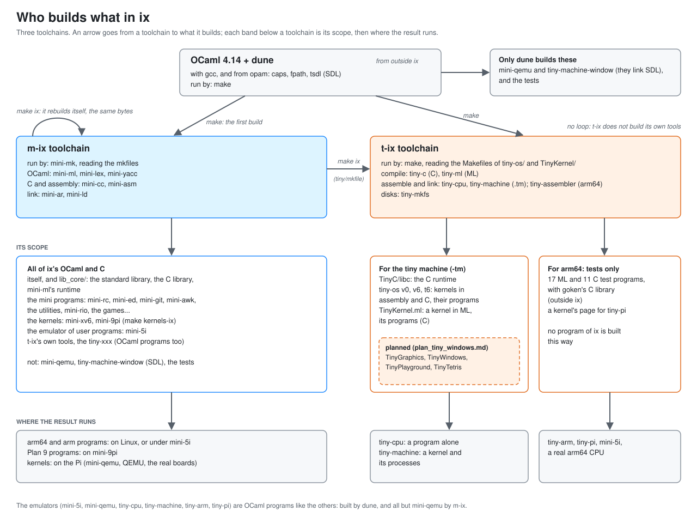

# t-ix: a programmer's manual

t-ix is the tiny half of ix (`tiny/`): a machine of our own design,
its assembler, a C and an ML compiler for it, and kernels that run on
it. This manual is the reference for someone writing a program or a
kernel for that machine: its registers, its devices and their
addresses, how a program is built and where it is loaded. It gathers what the
programs' headers say (`TinyLibCPU.ml`'s, `TinyMachine.ml`'s,
`TinyKernel.ml`'s): they are the first source, and where this manual
and a header differ, the header is right. Each
program's header says how it works and why
([`tiny/README.md`](../../tiny/README.md) lists them); the plans say
how each was decided ([plan_tiny_os.md](../plans/plan_tiny_os.md),
[plan_tiny_windows.md](../plans/plan_tiny_windows.md),
[notes_tiny_kernel.md](../notes_tiny_kernel.md)).

The other tiny programs (tiny-build, tiny-shell, tiny-editor, tiny-db,
tiny-vcs) and the arm64 side (tiny-assembler, tiny-arm, tiny-pi) run
on the host or on a real architecture and are not covered here.

## 1. The quick way

    ./tiny-machine tiny-kernel    # TinyKernel.ml, a kernel in ML: a shell on the console
    ./tiny-machine -window tiny-kernel    # and its screen in a window: paint draws there
    ./tiny-machine v6             # tiny-os v6, xv6's kind of kernel in C, with its disk
    ./tiny-machine t6             # tiny-os t6, v6's free variant
    ./tiny-machine v0             # tiny-os v0, a page of assembly and four programs
    ./tiny-machine kernel.tm a.tm # a kernel of yours, and its programs

`-l` prints the kernel's listing instead of running it, `-n` skips the
build, `-w` keeps v6's and t6's writes to their disk. Ctrl-D ends the
shell and the machine, Ctrl-\ quits at once, Ctrl-C goes to the kernel.

The script builds the tools with dune and calls them. By hand:

| tool | what it does |
|---|---|
| `tiny-cpu f.tm...` | assembles, links and runs a program alone, the host answering its three system calls |
| `tiny-machine k.tm p.tm...` | the same with the machine around the CPU: the first file is the kernel |
| `tiny-c -tm -o f.tm f.c` | C to the machine's assembly |
| `tiny-ml -tm -o f.tm f.ml` | ML to the machine's assembly |
| `tiny-mkfs` | v6's and t6's disk images |

`tiny-cpu -h` and `tiny-machine -h` show each option on an example.

## 2. How t-ix is put together

The picture is all of ix's: t-ix is its right half. The rest of this
section is that half in words.

### 2.1 Two worlds

A tiny program is either the host's or the tiny machine's.

    the host (OCaml, built by dune or by ix's own tools)
      tiny-c, tiny-ml          compilers: C and ML to .tm assembly
      tiny-cpu, tiny-machine   the assembler, the linker and the machine
      tiny-mkfs                disk images
      tiny-machine-window      the screen in a window (SDL)
            |
            |  .tm files, linked to an image
            v
    the tiny machine (assembly, C and ML, built by the programs above)
      tiny-os/libc/            the C runtime
      tiny-os/v0, v6, t6       kernels in assembly and C, and their programs
      TinyKernel.ml            a kernel in ML, and its programs
      TinyML_core.c            the ML runtime, in C

`TinyKernel.ml` is in `tiny/` beside the host's programs but is not
one of them: OCaml never compiles it, tiny-ml does.

### 2.2 What a host program needs outside `tiny/`

Each is one file, but not all stand alone. From `tiny/dune`:

| program | outside `tiny/` |
|---|---|
| tiny-c, tiny-ml | nothing: OCaml's standard library only |
| tiny-editor | `unix` |
| tiny-db | `unix`, `caps` |
| tiny-cpu, tiny-arm, tiny-pi, tiny-assembler, tiny-mkfs | `lib_core/`, `fpath`, `caps` |
| tiny-machine, tiny-build, tiny-shell | `lib_core/`, `fpath`, `caps`, `unix` |
| tiny-vcs | the same, and `lib_crypto/` (SHA-1), `lib_compression/` (zlib) |
| tiny-machine-window | `raspberry/` (mini-qemu's `Sdl_display`), SDL by `tsdl` |

Inside `tiny/`, two libraries are shared: `TinyLibCPU.ml` (tiny-cpu
and tiny-machine) and `TinyLibArm.ml` (tiny-arm and tiny-pi).

What they take from `lib_core/` is its `commons/`: `FS` (a file read
or written whole), `Console` (printing), `Procs` (children and
pipes). `caps` gives the capabilities each `main` takes (`Cap.stdin`,
`Cap.open_in`...), `fpath` the paths.

### 2.3 Two ways to build the host's programs

- **By dune** (`make`, or `dune build`): OCaml 4.14 with its standard
  library, and `caps`, `fpath` and `tsdl` from opam. The executables
  are `_build/default/tiny/TinyXxx.exe`, installed as `tiny-xxx`.
- **By ix's own tools** (`tiny/mkfile`, read by mini-mk): mini-ml
  compiles each file and mini-ld links it, with ix's standard library
  (`lib_core/`, where `Cap`, `Fpath` and `Unix` are ix's own). No C
  library is linked. All the programs of 2.2 are built so, but
  tiny-machine-window.

So a tiny program is written in what both accept, and ix's library
is the smaller one: it has no `Scanf`, for example, and its
`Option.value` takes no label.

### 2.4 How the tiny machine's programs are built

By Makefiles that call the host's tools, taken from the `PATH` or
from ix's `bin/`:

| Makefile | what it builds |
|---|---|
| `tiny/tiny-os/Makefile` | `libc/libc.tm`, `hello`, then each version |
| `tiny/tiny-os/v6/`, `t6/` | `kernel.img`, the user programs, `fs.img` (tiny-mkfs) |
| `tiny/TinyKernel/Makefile` | `kernel.img`, the user programs, `boot.img` |

The steps are always the same three:

    tiny-c -tm -o x.tm x.c          # or tiny-ml -tm, for ML
    tiny-machine -o kernel.img entry.tm ... x.tm     # a kernel: linked at 0
    tiny-cpu -o prog start.tm udivmod.tm libc.tm prog.tm   # a program

TinyKernel.ml has no disk: `boot.img` is `kernel.img` followed by
its files, each a name, a size and its bytes, which the kernel reads
at its start.

### 2.5 What runs what

    ./tiny-machine tiny-kernel
      -> dune builds the host's tools
      -> make -C tiny/TinyKernel boot.img    (tiny-ml, tiny-c, tiny-cpu, tiny-machine -o)
      -> tiny-machine boot.img
           the kernel at 0, in supervisor mode
           -> /sh in a partition, in user mode
                -> the programs it runs, each a process

## 3. The CPU (`TinyLibCPU.ml`)

- **16 registers of 32 bits**, `r0` to `r15`. `r0` is always 0. By
  convention `sp` is `r14` and `lr` is `r15`.
- **No flags.** A branch compares two registers; `slt` makes a
  comparison a value.
- **One format**, 4 bytes an instruction: an 8-bit opcode, two 4-bit
  registers `d` and `a`, a 16-bit immediate whose low 4 bits name the
  third register.

| instructions | meaning |
|---|---|
| `add sub mul div rem and or xor shl shr sar slt sltu` | `d = a op b` |
| `addi andi ori xori shli shri sari slti sltiu` | `d = a op imm` |
| `lui` | `d = imm << 16` |
| `ldw ldb stw stb` | `d, imm(a)`: a word or a byte loaded or stored |
| `beq bne blt bge bltu bgeu` | `d, a, label` |
| `jal jalr` | a jump, `d = pc + 4` |
| `sys n` | a system call, its number `n` |

The assembler adds `li`, `la`, `mov`, `call`, `ret`, `j` and `nop`,
and the directives `.word`, `.byte`, `.ascii`, `.asciz`, `.space` and
`.align`. A comment starts with `;`.

Every case is defined: a division by 0 gives -1, a shift takes its
amount modulo 32, an address is taken modulo the memory's size, and a
word's two low address bits are ignored.

**Why `-16(r0)` is a device.** Since `r0` is 0 and addresses wrap, a
negative offset from `r0` is an address counted down from the top of
memory. The devices are there (section 5), so any instruction reaches
one without setting up a register: `stb r3, -16(r0)` prints a byte.

## 4. The machine (`TinyMachine.ml`)

The CPU with what a kernel needs. 16 MB of memory. It starts at
address 0 in supervisor mode, with `sp` just below the devices.

### 4.1 Modes and traps

Two modes, supervisor and user. One way in: a trap saves the pc in
`epc`, the reason in `cause`, a detail in `tval`, enters supervisor
mode with interrupts off, and jumps to `tvec`. One way out: `eret`.

| `cause` | reason | `tval` | `epc` |
|---:|---|---|---|
| 1 | `sys n` | `n` | after the `sys` |
| 2 | an illegal instruction | the word | on it |
| 3 | a fault (an address not allowed) | the address | on the instruction |
| 4 | an interrupt | its sources, a bit each | on the instruction not yet run |

### 4.2 The registers of control

Read by `csrr d, name`, written by `csrw name, a`, both at once by
`csrrw d, name, a`. All three, and `eret`, are illegal in user mode.

| name | what |
|---|---|
| `status` | bit 1 supervisor mode, 2 interrupts on, 4 and 8 those two as they were before the trap, 16 the window relocates |
| `epc`, `cause`, `tval`, `tvec` | the trap's (above) |
| `time` | the instructions run so far (read only) |
| `timecmp` | the timer interrupts when `time` reaches it |
| `base`, `bound` | the window (4.4) |
| `satp` | the pages' root; its top bit turns pages on (4.4) |
| `ip`, `ie` | the interrupts pending (read only) and enabled, a bit a source |
| `hartid` | the core's number, 0 (read only) |
| `scratch` | a word for the kernel |

The time is the count of instructions, not the host's clock, so the
same image with the same input runs the same every time.

One more instruction, legal in both modes: `amoswap d, a, (b)`, the
word at the address in `b` swapped with `a` in one step, for a lock.

### 4.3 Interrupts

An interrupt is taken when `status` has interrupts on and a source is
both pending and enabled. `tval` then holds the sources.

| bit | source | pending until |
|---:|---|---|
| 1 | the timer | `timecmp` is moved past `time` |
| 2 | the console's input | its bytes are read |
| 4 | the disk | its status word is written |
| 8 | the mouse | its word is read |

Only the timer is enabled at the start.

### 4.4 Protection: a window, or pages

In user mode, with pages off, an address must be inside the window.

- **Plain** (v0): `base <= address < bound`. A program is assembled
  where it runs.
- **Relocating** (`status` bit 16; t6, TinyKernel.ml): the address
  must be below `bound`, and `base` is added to it. Every program is
  assembled at 0.

With `satp`'s top bit set (v6), addresses go through two-level page
tables instead, RISC-V's Sv32: 10 bits of index in the root table, 10
in the next, 12 in a 4 KB page. An entry's flag bits are 1 valid, 2
read, 4 write, 8 execute, 16 user. Supervisor mode reaches every
valid page.

## 5. The devices

Eight words at the top of memory, outside any window, so only a
kernel reaches them.

| address | | device |
|---|---|---|
| `-32(r0)` | `0xffffe0` | the disk: a block's number |
| `-28(r0)` | `0xffffe4` | the disk: a memory address |
| `-24(r0)` | `0xffffe8` | the disk: the command, 1 read the block into memory, 2 write it from memory |
| `-20(r0)` | `0xffffec` | the disk: reads 1 when a transfer is done; a write ends its interrupt |
| `-16(r0)` | `0xfffff0` | the console's output: a byte stored is printed |
| `-12(r0)` | `0xfffff4` | the halt: the value stored is the machine's exit status |
| `-8(r0)` | `0xfffff8` | the console's input: the next byte; `0xffffffff` none yet, `0xfffffffe` the input's end |
| `-4(r0)` | `0xfffffc` | the mouse (5.2) |

The disk is a file given by `-d`, in blocks of 1 KB. A transfer is
done at once, and the file is written back when the machine halts.

### 5.1 The screen

640 by 480 pixels, one byte each, row after row from `0xf00000`. It
is memory like any other: `stb` stores a pixel, and a kernel that has
no use for a screen may use that megabyte as memory.

A byte is a colour in Plan 9's table of 256 (its `m8` pixels): 0 is
black, 255 white, `0xf0` red, `0x36` blue, `0xaa` a grey.

    tiny-machine -window kernel.img          # the screen in a window of the host's
    tiny-machine -screen out.ppm kernel.img  # the screen written at the halt, a PPM

### 5.2 The mouse and the keys

The mouse is one word: x in bits 0 to 11, y in bits 12 to 23, the
buttons from bit 24 (1 left, 2 middle, 4 right). Its interrupt is
pending from a change until the word is read.

The keys have no register of their own: they are the console's input,
`-8(r0)`. Without a window they come from the terminal or a pipe.
With `-window` they are typed in the window; the arrows are the bytes
128 to 131 (up, down, left, right).

### 5.3 A session replayed: `-events`

    tiny-machine -events session.txt -screen out.ppm kernel.img

The mouse and the keys come from a file, a line an event, each with
the time (in instructions) it happens at:

    2000000 m 50 50 0        the mouse at 50, 50, no button
    2100000 m 300 150 1      there, the left button down
    2300000 k ls\n           these keys typed

In a `k` line, `\n` is a new line and `\` with three digits a byte
(`\003`). The input ends after the last event. As the time is the
instructions counted, the screen at the halt is the same on every
run: this is how a program with a mouse is tested
(`tiny/tests/TinyMachine_tests/screen.tm`).

### 5.4 The window is another program

`tiny-machine -window` runs `tiny-machine-window`
(`TinyMachineWindow.ml`) as a child. It sends it the screen, a PPM
each time it changed, about thirty times a second, and reads back
event lines, section 5.3's without their times. tiny-machine itself
links no C library, so ix's own tools build it; the window is the one
tiny program that needs SDL.

## 6. Programs

### 6.1 The link, and an image

There is no object file. The `.tm` files given are assembled one
after the other, their labels in one namespace, the first at address
0, where the machine starts. `-o` writes the result, an image: the
memory's first bytes, with no header.

### 6.2 C: `tiny-c -tm`

The arguments are on the stack, at `0(sp)`, `4(sp)` and so on; the
result is in `r13`; the callee may change any register but `sp`.

A program is linked after its runtime (`tiny/tiny-os/libc/`):

    tiny-c -tm -o prog.tm prog.c
    tiny-cpu -o prog start.tm udivmod.tm libc.tm prog.tm
    tiny-cpu ./prog one two

`start.tm` calls `main` and exits with its result. `libc.h` declares
`write`, `exits`, `print`, `sprint`, `malloc`, `free`, `strlen`,
`strcpy`, `strcmp`, `memset` and `atoi`.

### 6.3 ML: `tiny-ml -tm`

One file, no modules. Integers are 31 bits (a value is `2n+1` or a
pointer), so a constant beyond them is refused. The runtime is
`TinyML_core.c`, compiled by `tiny-c -tm`, with a `main` that gives
it its memory. A C or assembly function is called as an `external`,
with C's convention and ML's values.

### 6.4 A system call

`sys n` with the arguments in `r1` to `r3` and the answer in `r1`.
What the numbers mean is up to who answers:

- under tiny-cpu, the host: 0 exit, 1 write, 2 read;
- under tiny-machine, the kernel that the trap enters (section 7).

## 7. The kernels

| kernel | language | protection | files |
|---|---|---|---|
| tiny-os v0 (`tiny/tiny-os/v0/`) | assembly | a plain window | none |
| tiny-os v6 (`tiny/tiny-os/v6/`) | C | pages | on a disk, xv6's format |
| tiny-os t6 (`tiny/tiny-os/t6/`) | C | a relocating window | on a disk, a FAT |
| TinyKernel.ml (`tiny/TinyKernel.ml`) | ML | a relocating window | ML values in memory |

### 7.1 TinyKernel.ml's memory

| addresses | what |
|---|---|
| from 0 | the kernel's image, then the files it carries |
| `0x180000` | the ML runtime's stack of values (the image and its files end below it) |
| `0x1c0000` | the processes' frames: 17 words each, their registers and pc |
| `0x200000` to `0x500000` | the ML heap, two halves |
| `0x500000` to `0xd00000` | eight partitions of 1 MB, a process each |
| `0xd00000` to `0xf00000` | the images a program made (`TinyGraphics.ml`'s free blocks) |
| `0xf00000` | the screen, 640 by 480 bytes; then images again |
| the last 32 bytes | the devices |

A process sees its partition as addresses 0 to 1 MB: its program is
loaded at 0, its stack starts at the top.

### 7.2 TinyKernel.ml's system calls

| n | call | n | call |
|---:|---|---:|---|
| 0 | `exit(status)` | 8 | `close(fd)` |
| 1 | `write(fd, buf, n)` | 9 | `pipe(fds)` |
| 2 | `read(fd, buf, n)` | 10 | `dup(fd)` |
| 3 | `fork()` | 11 | `mkdir(path)` |
| 4 | `exec(path, argv)` | 12 | `unlink(path)` |
| 5 | `wait(&status)` | 13 | `chdir(path)` |
| 6 | `getpid()` | 14 | `kill(pid)` |
| 7 | `open(path, mode)` | 15 | `ready(fds, n, until)` |
| 17 | `box(fds)` | 16 | `ticks()` |

A call that fails answers -1. Its C programs are in
`tiny/TinyKernel/user/`, with `user.h` and `sys.tm`.

`ready` answers the first of `n` descriptors that a read would not
wait on, or -1 when the clock reaches `until` (0: no limit; with no
descriptor it is a sleep). `ticks` is the clock: the timer's
interrupts since the boot, one every 20,000 instructions. `box` makes
a box, a pipe that keeps only what was last written: `fds[0]` reads it
(a read waits for a write since the last read), `fds[1]` writes it and
never waits. A process has 32 descriptors.

### 7.3 TinyKernel.ml's screen and mouse

The kernel has the pixels (`tiny/TinyGraphics.ml`, compiled with it);
a program says what to draw. **A program is given five descriptors**:
0, 1 and 2 its text, 3 where it draws (messages, below), 4 its mouse (a
box: a read gives x, y and the buttons, a word each, when they
changed). The first shell's are the console, the screen and the
machine's mouse, and its programs inherit them; a window system gives
a window's shell pipes and a box instead (7.4), so a program does not
know which it has. The same three as files of the root, for a program
that wants the screen itself:

| file | a read | a write |
|---|---|---|
| `/console` | the keys typed, as they come | the terminal |
| `/draw` | | messages, whole; a bad one is said on the console and the write answers -1 |
| `/mouse` | waits until the mouse changed, then 12 bytes: x, y, the buttons (1 left, 2 middle, 4 right), a word each | |

A connection (descriptor 3, or an open of `/draw`) has its images by
numbers of the program's, 0 the one it was given, freed when its last
descriptor is closed. A
message is a letter, then numbers of 16 bits, the low byte first,
signed:

| message | what |
|---|---|
| `a id x0 y0 x1 y1 repl colour` | an image made, of that rectangle, filled with a colour's byte (the one that had this number is freed); `repl` 1: it repeats (a colour is an image of one pixel that does) |
| `f id` | freed |
| `d dst src mask x0 y0 x1 y1 px py` | draw: `dst`'s rectangle is `src`'s pixels from (px, py) on, where `mask`'s are not 0 (-1: no mask) |
| `l dst src x0 y0 x1 y1` | a line, both ends drawn |
| `s dst src x y n`, then `n` bytes | a text, its top left corner at (x, y); a character is 8 by 16 |

A colour's byte is an index of Plan 9's table of 256 (0 black, 255
white). For C, `user/draw.h` and `draw.c` gather the messages
(`d_fill`, `d_text`, `d_flush`...); `user/paint.c` is a program of a
page that waits for the mouse, the keys and the clock at once. For ML,
`tiny/TinyDraw.ml` makes them.

    ./tiny-machine -window tiny-kernel
    $ paint

### 7.4 tiny-windows

`tiny/TinyWindows.ml`, a program of TinyKernel.ml's in ML (compiled by
tiny-ml -tm after `TinyDraw.ml`; `user/mlsys.c` is an ML program's
runtime and system calls), is the window system:

    ./tiny-machine -window tiny-kernel
    $ tiny-windows

| the mouse | what |
|---|---|
| the right button | the menu: New, Move, Delete, Exit; let go on an item |
| then the left button | New: a rectangle swept, a shell in it; Move: a window dragged; Delete: a window pointed at |
| the left button on a window | it comes to the front, and has the keys |

A window is a text until a program draws in it: what is printed is
shown and scrolled, a line typed is edited and given at the Enter,
Control-D ends the shell's input, and the window with it. When a
program draws (`paint`), the window is its picture: the keys go to it
as typed and the mouse in the window is its mouse, until something is
printed again. A window's program is given three pipes and a box as
its five descriptors; tiny-windows reads what it draws, changes its
images' numbers and sends the messages on, the kernel keeping every
pixel. `tiny-windows` typed in a window runs there, with windows of
its own.

## 8. Tests

| what | how |
|---|---|
| the CPU | `tiny/tests/TinyCPU_test.sh` |
| the machine, v0, the devices, the screen | `tiny/tests/TinyMachine_test.sh` |
| v6, t6 | `make -C tiny/tiny-os/v6 check`, `make -C tiny/tiny-os/t6 check` |
| TinyGraphics.ml, on the host and on the machine | `tiny/tests/TinyGraphics_test.sh` (`-window`: its picture shown) |
| TinyKernel.ml; paint, tiny-windows and tiny-windows in a window, each with a recorded mouse | `make -C tiny/TinyKernel check` (a minute) |

On macOS they need GNU's coreutils first in the `PATH` (`stat -c`,
`wc`).
